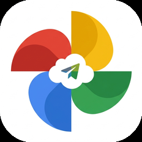
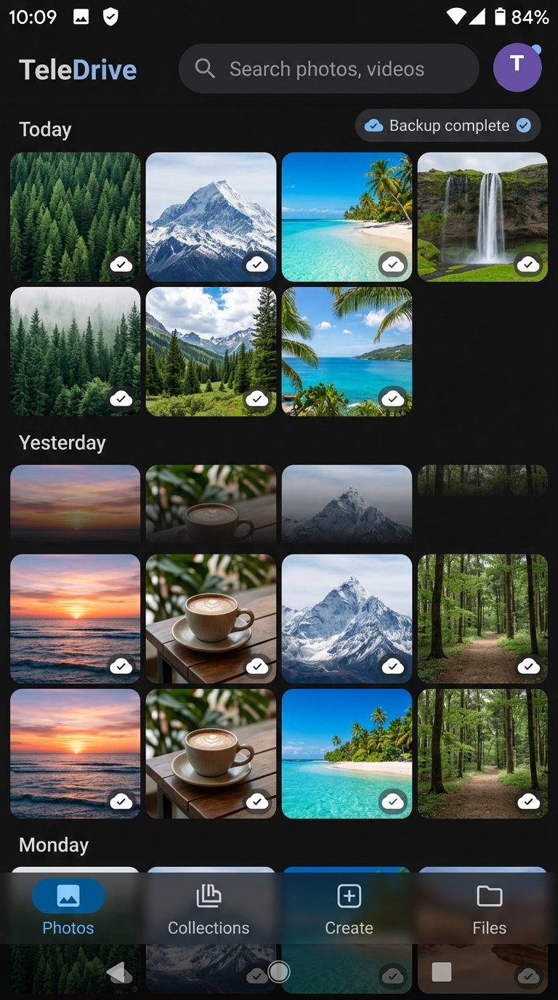
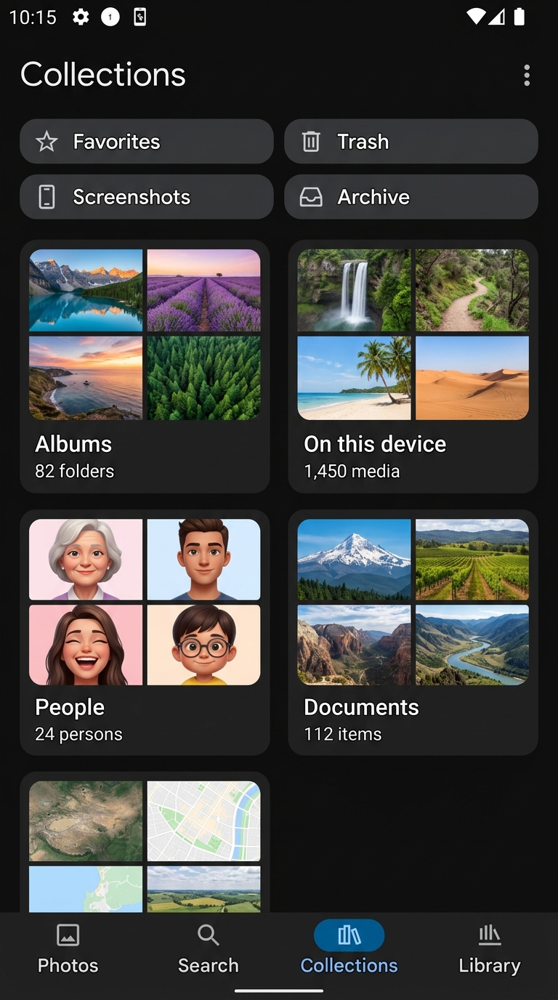
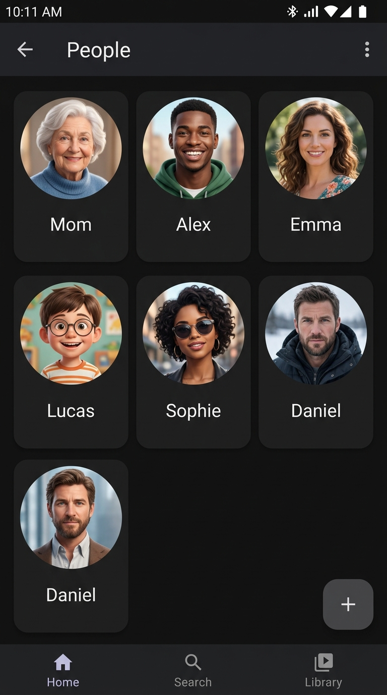
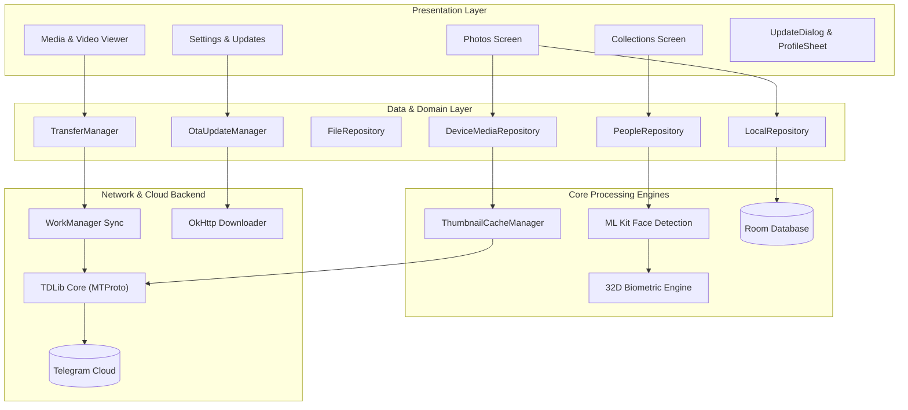
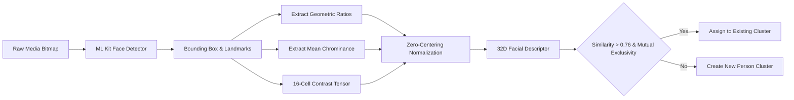
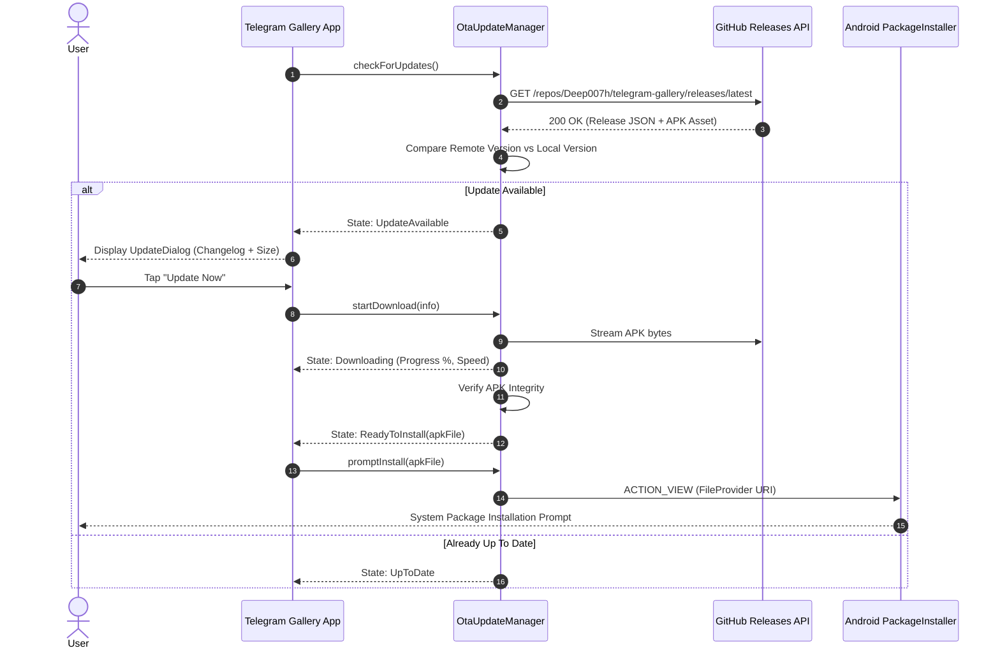

# 🖼️ Telegram Gallery

<div align="center">



<br/>
<br/>

-3DDC84?logo=android&logoColor=white)


**Unlimited Telegram Cloud Storage & Media Gallery for Android, wrapped in an ultra-smooth Google Photos experience.**

[Download Latest APK](https://github.com/Deep007h/telegram-gallery/releases/latest) • [Key Features](#-key-features) • [Architecture](#-architecture) • [Building](#%EF%B8%8F-building-from-source)

</div>

---

## 🌟 Highlights

**Telegram Gallery** turns your Telegram account into an **unlimited, secure, and private personal cloud gallery and drive** with the exact fluidity, design language, and intelligent organization of Google Photos.

- ☁️ **Unlimited Free Storage**: Backed by Telegram MTProto Cloud (`Saved Messages` or private storage channels).
- 📸 **Unified Photos Feed**: Seamlessly integrates local on-device media with Telegram Cloud files in a chronological timeline.
- 👥 **On-Device Facial Clustering**: Automatically groups faces into people albums using Google ML Kit and 32-dimensional zero-centered biometric descriptors without sending facial data anywhere.
- ⚡ **120Hz Fluid UI**: Custom frame-pacing, low-priority background loaders, and zero-flicker cached media delivery eliminate frame drops.
- 🔄 **Native Over-The-Air (OTA) Updates**: Automatically checks GitHub Releases for new updates, downloads with real-time speed progress, and invokes native package installation.

---

## 📱 Screenshots

<div align="center">
  <table>
    <tr>
      <td align="center"><b>Photos Feed</b></td>
      <td align="center"><b>Collections & Albums</b></td>
      <td align="center"><b>AI People Separation</b></td>
    </tr>
    <tr>
      <td></td>
      <td></td>
      <td></td>
    </tr>
  </table>
</div>

---

## 🚀 Key Features

### 1. Unified Device + Cloud Stream
- **Chronological Date Grouping**: Photos and videos are organized by day and month headers.
- **Cloud Status Indicators**: Backed-up items feature an unobtrusive cloud badge in the bottom-right corner.
- **Media Stack & Duration Badges**: Multi-shot bursts show stack counters (`3 ❐`), and videos show formatted durations (`0:16 ▶`).
- **Seamless Local/Cloud Switching**: Filter between your Telegram Storage Channel and Saved Messages on the fly.

### 2. Intelligent Categorized Collections
- **2×2 Quick Actions**: Quick access chips for `Favorites`, `Trash`, `Screenshots`, and `Archive`.
- **Quadrant Category Cards**:
  - 📁 **Albums**: Physical device camera folders, WhatsApp media, screenshots, and custom albums.
  - 📱 **On this device**: Local folders with item counts and preview thumbnails.
  - 👥 **People**: Circular portrait avatars representing individuals detected in your photos.
  - 📄 **Documents**: Receipts, identification documents, PDFs, and document photos.
  - 📍 **Places**: Geographic locations categorized from photo metadata.

### 3. On-Device AI Facial Clustering
- **Zero-Centered Biometric Representation**: Mean-subtracted landmark geometry, chrominance baselines, and luminance contrast tensors allow high inter-person separation without heavy neural models.
- **Same-Photo Mutual Exclusivity**: Enforces the constraint that two faces present in the same photo can never be merged into the same cluster.
- **100% Private**: All detection and clustering occurs strictly on-device; no facial biometric data ever leaves your phone.

### 4. Zero-Stutter 120Hz Smooth Scrolling
- **Bounded Background Parallelism**: Image decoding and ML inferences are isolated to `Dispatchers.IO.limitedParallelism(2)` under `Process.THREAD_PRIORITY_BACKGROUND`.
- **Paced Preloading**: Micro-delays between tile requests prevent CPU thread contention, ensuring 100% of UI looper deadlines are met on 120Hz displays.
- **Zero-Flicker Hardware Accelerated Thumbnails**: Immediate Frame-0 bitmap drawing for cached files with smooth crossfades for remote items.

### 5. Native Over-The-Air (OTA) Updates
- Directly queries GitHub Releases (`/repos/Deep007h/telegram-gallery/releases/latest`) or custom JSON endpoints.
- Streaming downloads with real-time download speed (`MB/s`) and progress bar.
- Automatic APK integrity verification (`PK\x03\x04` magic bytes) and `FileProvider` package installer invocation.
- Customizable update URL directly within in-app Settings.

---

## 🏗️ Architecture

Telegram Gallery follows modern Android Clean Architecture and MVI principles built around Jetpack Compose.



### Face Clustering Pipeline



### Over-The-Air (OTA) Pipeline



---

## 🛠️ Tech Stack

- **UI & Design**: [Jetpack Compose](https://developer.android.com/jetpack/compose), [Material 3](https://m3.material.io/), Compose Navigation
- **Architecture**: MVI / MVVM, Clean Architecture, Kotlin Coroutines & Flows
- **Database & Local Storage**: [Android Room](https://developer.android.com/training/data-storage/room), DataStore Preferences
- **Telegram Core**: [TDLib (Telegram Database Library)](https://core.telegram.org/tdlib) v1.8.x with native C++ JNI bindings
- **Computer Vision & ML**: Google ML Kit Face Detection, Custom Zero-Centered Biometric Tensor Clustering
- **Image & Media Engine**: [Coil 2.5](https://coil-kt.github.io/coil/) (hardware bitmaps & video frames), [AndroidX Media3 ExoPlayer](https://developer.android.com/media/media3)
- **Background Tasks**: AndroidX WorkManager for background synchronization and transfer resume
- **Networking**: [OkHttp 4](https://square.github.io/okhttp/) with streaming byte channels

---

## ⚙️ Building from Source

### Prerequisites
1. **Android Studio** (Iguana 2023.2.1 or newer recommended).
2. **JDK 17** configured as your Gradle JDK.
3. **Android SDK 34** (Build Tools 34.0.0, Min SDK 26).

### 1. Clone the Repository
```bash
git clone https://github.com/Deep007h/telegram-gallery.git
cd telegram-gallery
```

### 2. Configure Telegram API Credentials
Telegram requires an `API_ID` and `API_HASH` to connect via MTProto.
1. Obtain credentials at [my.telegram.org](https://my.telegram.org).
2. Check or customize them in `Constants.kt`:
```kotlin
const val API_ID = YOUR_API_ID
const val API_HASH = "YOUR_API_HASH"
```

### 3. Build the APK
```bash
# Debug build
./gradlew assembleDebug

# Release build
./gradlew assembleRelease
```
The output APK will be located in:
`app/build/outputs/apk/debug/app-debug.apk`

---

## 📦 Releases & Installation

You can download the pre-compiled, ready-to-install APK directly from the [Releases](https://github.com/Deep007h/telegram-gallery/releases) tab.

Once installed, future updates will be delivered seamlessly inside the app through the built-in Over-The-Air updater.

---

## 📄 License

This project is licensed under the **MIT License** — see the [LICENSE](LICENSE) file for details.

---

<div align="center">
Made with ❤️ by <a href="https://github.com/Deep007h">Deep007h</a>
</div>
